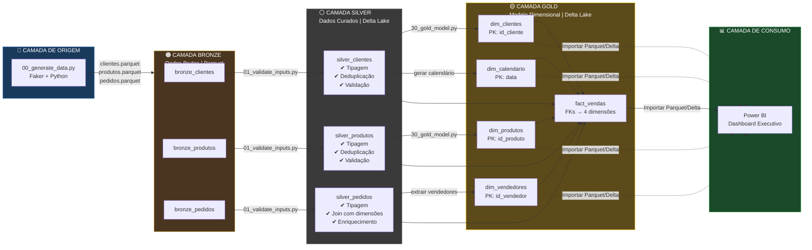
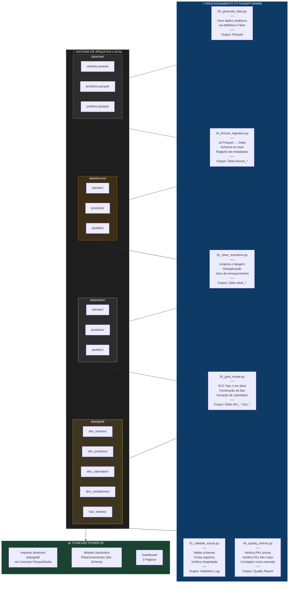
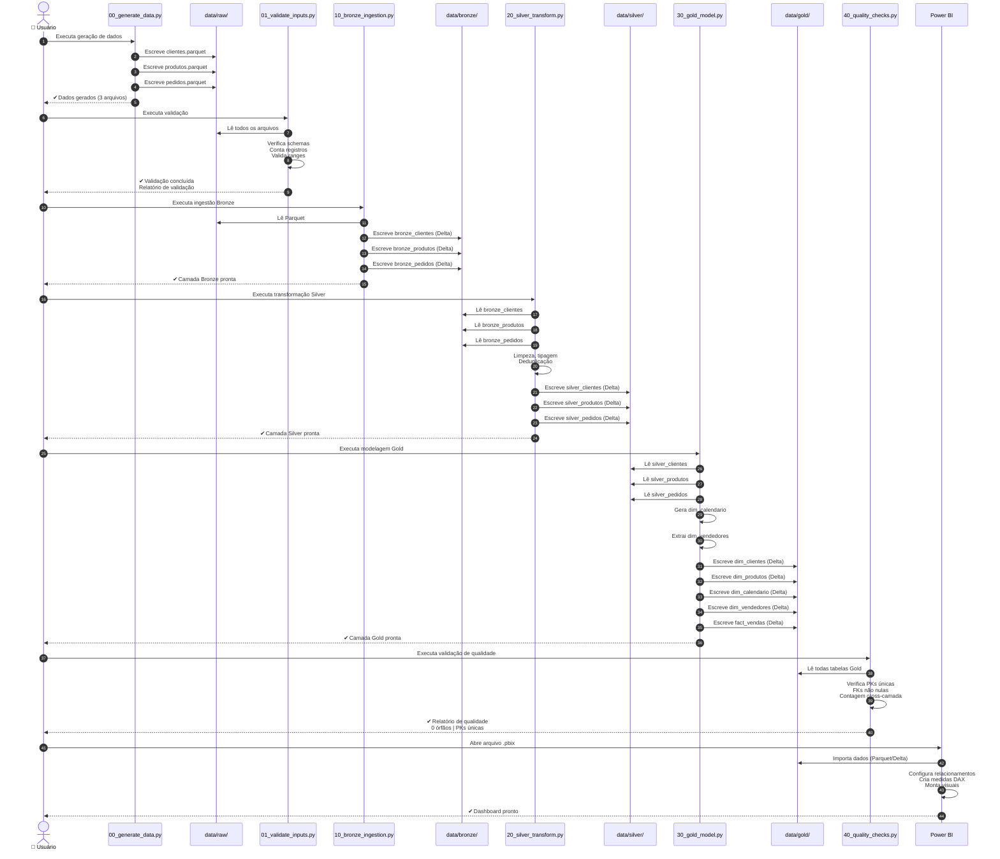
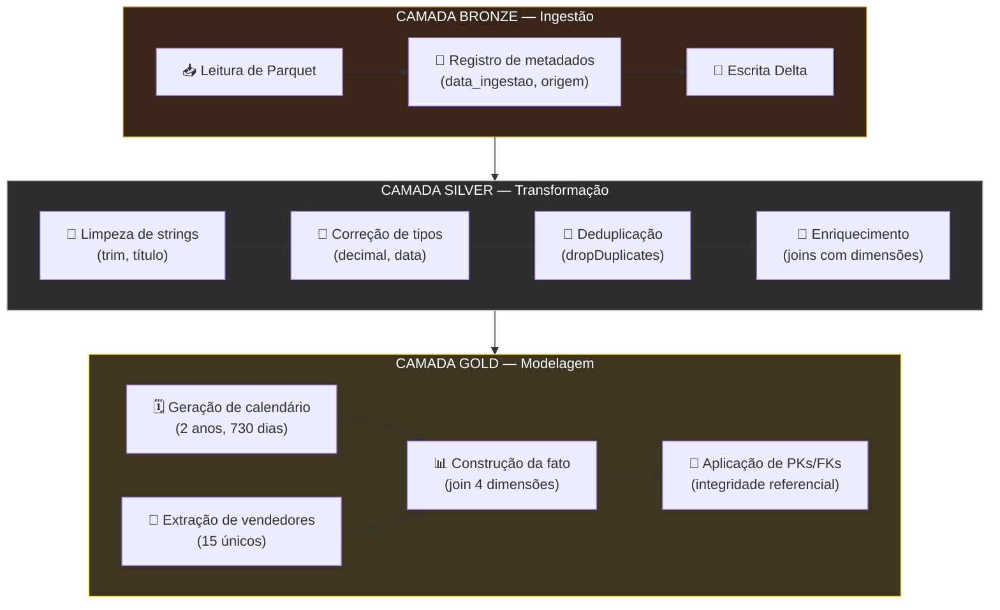

# 🏗️ Arquitetura Medalhão — BI E-Commerce

## 1. Fluxo Completo da Arquitetura Medalhão

## 2. Arquitetura Detalhada (Byte-Level)

## 3. Diagrama de Sequência — Ordem de Execução do Pipeline

## 4. Resumo das Transformações por Camada

