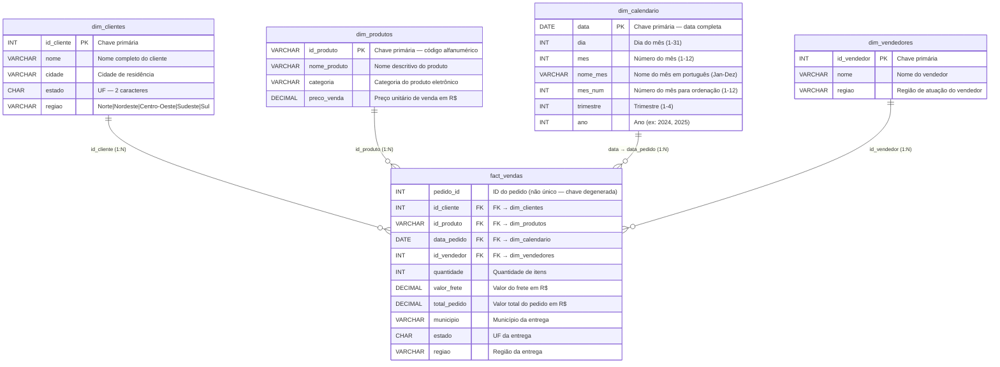
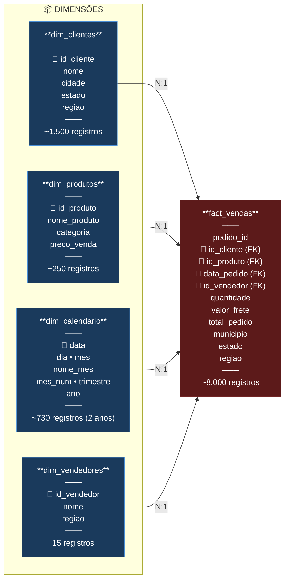

# 📐 Modelo Dimensional — Star Schema

## Diagrama Entidade-Relacionamento (ER)

## Diagrama Esquemático (Estilo Flowchart)

## Tabela de Relacionamentos

| Tabela Fato | Chave Estrangeira | Tabela Dimensão | Chave Primária | Cardinalidade | Tipo de Relacionamento |
|-------------|-------------------|-----------------|----------------|---------------|------------------------|
| fact_vendas | id_cliente | dim_clientes | id_cliente | N:1 | Muitos-para-Um |
| fact_vendas | id_produto | dim_produtos | id_produto | N:1 | Muitos-para-Um |
| fact_vendas | data_pedido | dim_calendario | data | N:1 | Muitos-para-Um |
| fact_vendas | id_vendedor | dim_vendedores | id_vendedor | N:1 | Muitos-para-Um |

## Regras de Integridade Referencial

| Regra | Descrição | Verificação |
|-------|-----------|-------------|
| PK Única — dim_clientes | Cada id_cliente aparece uma única vez | `COUNT(id_cliente) = COUNT(DISTINCT id_cliente)` |
| PK Única — dim_produtos | Cada id_produto aparece uma única vez | `COUNT(id_produto) = COUNT(DISTINCT id_produto)` |
| PK Única — dim_calendario | Cada data aparece uma única vez | `COUNT(data) = COUNT(DISTINCT data)` |
| PK Única — dim_vendedores | Cada id_vendedor aparece uma única vez | `COUNT(id_vendedor) = COUNT(DISTINCT id_vendedor)` |
| FK NOT NULL — id_cliente | Nenhum pedido sem cliente | `COUNT(*) WHERE id_cliente IS NULL = 0` |
| FK NOT NULL — id_produto | Nenhum pedido sem produto | `COUNT(*) WHERE id_produto IS NULL = 0` |
| FK NOT NULL — data_pedido | Nenhum pedido sem data | `COUNT(*) WHERE data_pedido IS NULL = 0` |
| FK NOT NULL — id_vendedor | Nenhum pedido sem vendedor | `COUNT(*) WHERE id_vendedor IS NULL = 0` |
| FK Válida — id_cliente | Todo id_cliente existe em dim_clientes | LEFT ANTI JOIN = 0 |
| FK Válida — id_produto | Todo id_produto existe em dim_produtos | LEFT ANTI JOIN = 0 |
| FK Válida — data_pedido | Toda data_pedido existe em dim_calendario | LEFT ANTI JOIN = 0 |
| FK Válida — id_vendedor | Todo id_vendedor existe em dim_vendedores | LEFT ANTI JOIN = 0 |

## Distribuição Estimada de Dados

| Dimensão | Registros | Granularidade |
|----------|-----------|---------------|
| dim_clientes | 1.500 | 1 linha por cliente |
| dim_produtos | 250 | 1 linha por produto |
| dim_calendario | 730 | 1 linha por dia (2 anos) |
| dim_vendedores | 15 | 1 linha por vendedor |
| fact_vendas | ~8.000 | 1 linha por item de pedido |
