# 🔄 Fluxo de Execução do Pipeline

## Diagrama de Execução dos Scripts

```mermaid
flowchart TD
    START(["▶ INÍCIO"]) --> GEN

    subgraph ETAPA0["ETAPA 0 — GERAÇÃO DE DADOS"]
        GEN["📄 00_generate_data.py<br/>─────<br/>Gera dados sintéticos<br/>usando biblioteca Faker"]
        GEN_OUT["📦 Artefatos Gerados:<br/>• clientes.parquet (1.500)<br/>• produtos.parquet (250)<br/>• pedidos.parquet (8.000)"]
        GEN --> GEN_OUT
    end

    GEN_OUT --> VAL_CHECK{"✅ Arquivos<br/>existem?"}
    VAL_CHECK -- "❌ Não" --> ERR1["⛔ ERRO:<br/>Falha na geração"]
    VAL_CHECK -- "✔ Sim" --> VAL

    subgraph ETAPA_VAL["ETAPA DE VALIDAÇÃO"]
        VAL["📄 01_validate_inputs.py<br/>─────<br/>Valida schemas<br/>Conta registros<br/>Verifica ranges"]
        VAL_OUT["📝 Artefatos Gerados:<br/>• validation_log.txt<br/>• Resumo de schemas"]
        VAL --> VAL_OUT
    end

    VAL_OUT --> VAL_PASS{"✅ Validação<br/>aprovada?"}
    VAL_PASS -- "❌ Não" --> ERR2["⛔ ERRO:<br/>Dados inválidos"]
    VAL_PASS -- "✔ Sim" --> BRZ

    subgraph ETAPA1["ETAPA 1 — CAMADA BRONZE"]
        BRZ["📄 10_bronze_ingestion.py<br/>─────<br/>Lê Parquet → Delta<br/>Registra metadados<br/>Schema-on-read"]
        BRZ_OUT["📦 Delta Tables:<br/>• bronze_clientes/<br/>• bronze_produtos/<br/>• bronze_pedidos/"]
        BRZ --> BRZ_OUT
    end

    BRZ_OUT --> BRZ_CHECK{"✅ Delta tables<br/>criadas?"}
    BRZ_CHECK -- "❌ Não" --> ERR3["⛔ ERRO:<br/>Falha na ingestão"]
    BRZ_CHECK -- "✔ Sim" --> SLV

    subgraph ETAPA2["ETAPA 2 — CAMADA SILVER"]
        SLV["📄 20_silver_transform.py<br/>─────<br/>Limpeza de strings<br/>Correção de tipos<br/>Deduplicação<br/>Enriquecimento"]
        SLV_OUT["📦 Delta Tables:<br/>• silver_clientes/<br/>• silver_produtos/<br/>• silver_pedidos/"]
        SLV --> SLV_OUT
    end

    SLV_OUT --> SLV_CHECK{"✅ Registros<br/>preservados?"}
    SLV_CHECK -- "❌ Não" --> ERR4["⛔ ERRO:<br/>Perda de dados"]
    SLV_CHECK -- "✔ Sim" --> GLD

    subgraph ETAPA3["ETAPA 3 — CAMADA GOLD"]
        GLD["📄 30_gold_model.py<br/>─────<br/>Cria dim_calendario (730 dias)<br/>Extrai dim_vendedores (15)<br/>SCD Tipo 1 nas dimensões<br/>Constrói fact_vendas"]
        GLD_OUT["📦 Delta Tables:<br/>• dim_clientes/<br/>• dim_produtos/<br/>• dim_calendario/<br/>• dim_vendedores/<br/>• fact_vendas/"]
        GLD --> GLD_OUT
    end

    GLD_OUT --> GLD_CHECK{"✅ 5 tabelas<br/>criadas?"}
    GLD_CHECK -- "❌ Não" --> ERR5["⛔ ERRO:<br/>Modelo incompleto"]
    GLD_CHECK -- "✔ Sim" --> QLT

    subgraph ETAPA4["ETAPA 4 — QUALIDADE"]
        QLT["📄 40_quality_checks.py<br/>─────<br/>Verifica PKs únicas<br/>Verifica FKs não nulas<br/>Contagem cross-camada<br/>Gera relatório final"]
        QLT_OUT["📝 Artefatos Gerados:<br/>• quality_report.txt<br/>• Métricas de qualidade"]
        QLT --> QLT_OUT
    end

    QLT_OUT --> QLT_PASS{"✅ Qualidade<br/>aprovada?"}
    QLT_PASS -- "❌ Não" --> WARN["⚠️ AVISO:<br/>Dados prontos com ressalvas"]
    QLT_PASS -- "✔ Sim" --> DONE

    WARN --> DONE
    DONE(["🏁 PIPELINE CONCLUÍDO<br/>Dados prontos para Power BI"])

    ERR1 --> END_ERR(["⛔ FIM COM ERRO"])
    ERR2 --> END_ERR
    ERR3 --> END_ERR
    ERR4 --> END_ERR
    ERR5 --> END_ERR

    style START fill:#1A4A2A,stroke:#50B86C,color:#FFFFFF
    style DONE fill:#1A4A2A,stroke:#50B86C,color:#FFFFFF
    style END_ERR fill:#4A1A1A,stroke:#E05A5A,color:#FFFFFF
    style ERR1 fill:#4A1A1A,stroke:#E05A5A,color:#FFFFFF
    style ERR2 fill:#4A1A1A,stroke:#E05A5A,color:#FFFFFF
    style ERR3 fill:#4A1A1A,stroke:#E05A5A,color:#FFFFFF
    style ERR4 fill:#4A1A1A,stroke:#E05A5A,color:#FFFFFF
    style ERR5 fill:#4A1A1A,stroke:#E05A5A,color:#FFFFFF
    style WARN fill:#5C4A1A,stroke:#E8A838,color:#FFFFFF
    style ETAPA0 fill:#1A3A5C,stroke:#4A90D9,color:#FFFFFF
    style ETAPA_VAL fill:#1A3A5C,stroke:#4A90D9,color:#FFFFFF
    style ETAPA1 fill:#3A2618,stroke:#B8860B,color:#FFFFFF
    style ETAPA2 fill:#2D2D2D,stroke:#C0C0C0,color:#FFFFFF
    style ETAPA3 fill:#3D3520,stroke:#FFD700,color:#FFFFFF
    style ETAPA4 fill:#1A2A3A,stroke:#4A90D9,color:#FFFFFF
```

## Diagrama de Dependências entre Scripts

```mermaid
flowchart TD
    subgraph DEP["📋 DEPENDÊNCIAS"]
        direction LR
        R["requirements.txt<br/>pyspark, delta-spark<br/>pandas, faker, pyarrow"]
    end

    subgraph S00["00_generate_data.py"]
        direction TB
        G1["import faker"]
        G2["import pandas as pd"]
        G3["Escreve data/raw/"]
        G1 --> G2 --> G3
    end

    subgraph S01["01_validate_inputs.py"]
        direction TB
        V1["import pandas as pd"]
        V2["Lê data/raw/"]
        V3["Valida e relata"]
        V1 --> V2 --> V3
    end

    subgraph S10["10_bronze_ingestion.py"]
        direction TB
        B1["from pyspark.sql import SparkSession"]
        B2["Lê Parquet → Delta"]
        B3["Escreve data/bronze/"]
        B1 --> B2 --> B3
    end

    subgraph S20["20_silver_transform.py"]
        direction TB
        S1["Leitura Delta bronze"]
        S2["Transformações"]
        S3["Escreve data/silver/"]
        S1 --> S2 --> S3
    end

    subgraph S30["30_gold_model.py"]
        direction TB
        G1G["Leitura Delta silver"]
        G2G["Modelagem Star Schema"]
        G3G["Escreve data/gold/"]
        G1G --> G2G --> G3G
    end

    subgraph S40["40_quality_checks.py"]
        direction TB
        Q1["Leitura Delta gold"]
        Q2["Validações"]
        Q3["Escreve quality_report.txt"]
        Q1 --> Q2 --> Q3
    end

    R --> S00
    R --> S10
    S00 --> S01
    S01 --> S10
    S10 --> S20
    S20 --> S30
    S30 --> S40

    style DEP fill:#1E1E1E,stroke:#666666,color:#FFFFFF
    style S00 fill:#1A3A5C,stroke:#4A90D9,color:#FFFFFF
    style S01 fill:#1A3A5C,stroke:#4A90D9,color:#FFFFFF
    style S10 fill:#3A2618,stroke:#B8860B,color:#FFFFFF
    style S20 fill:#2D2D2D,stroke:#C0C0C0,color:#FFFFFF
    style S30 fill:#3D3520,stroke:#FFD700,color:#FFFFFF
    style S40 fill:#1A2A3A,stroke:#4A90D9,color:#FFFFFF
```

## Resumo de Artefatos por Script

| Script | Entrada | Saída | Formato |
|--------|---------|-------|---------|
| `00_generate_data.py` | Nenhuma (geração sintética) | `data/raw/clientes.parquet` `data/raw/produtos.parquet` `data/raw/pedidos.parquet` | Parquet |
| `01_validate_inputs.py` | `data/raw/*.parquet` | `validation_log.txt` | Texto |
| `10_bronze_ingestion.py` | `data/raw/*.parquet` | `data/bronze/{clientes,produtos,pedidos}/` | Delta Lake |
| `20_silver_transform.py` | `data/bronze/{clientes,produtos,pedidos}/` | `data/silver/{clientes,produtos,pedidos}/` | Delta Lake |
| `30_gold_model.py` | `data/silver/{clientes,produtos,pedidos}/` | `data/gold/dim_*/` `data/gold/fact_vendas/` | Delta Lake |
| `40_quality_checks.py` | `data/gold/*/` | `quality_report.txt` | Texto |
